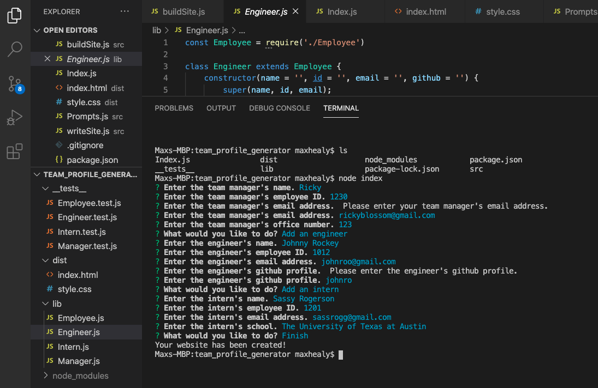
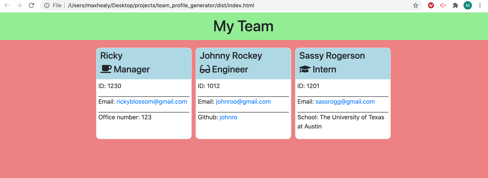

# Team Profile Generator

## Description

This app takes user input at the command line and creates an HTML page from it. The page displays cards featuring the information of each employee that is entered.

## Installation

Clone the repo in your local directory. When in the local directory, type 'npm init' so that you can use the Inquirer package. 

## Usage

From the project folder, type 'node index' in the command line to launch the program. Then, provide the information you are asked. You can continue adding Engineers and Interns until you are done, at which point you select the 'Finish' option from the menu. Then, a new HTML file will be created in the /dist folder with the information you provided.

